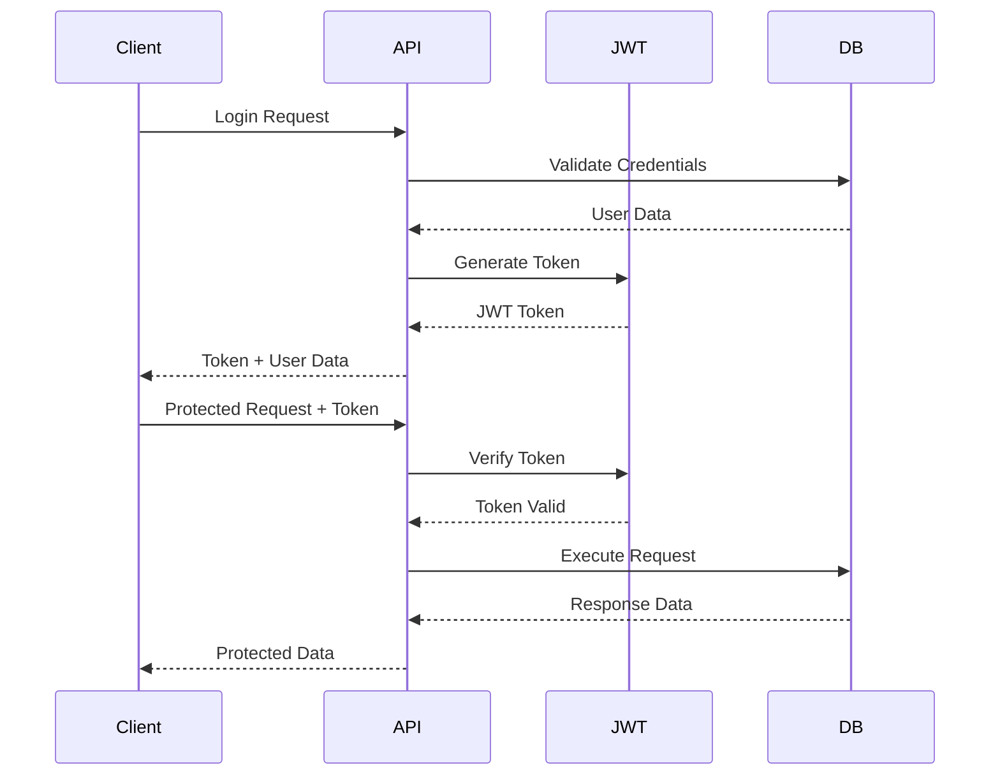

# 🏗️ Free Clouds - Technical Architecture

## Overview

Free Clouds is a modern, full-stack cloud storage application built with Next.js 14, featuring a comprehensive file preview system, secure authentication, and scalable architecture. This document outlines the technical architecture, design patterns, and implementation details.

**Tech Stack**: Next.js 14, React 18, TypeScript, MongoDB, Tailwind CSS, Telegram API
**Architecture Pattern**: Full-Stack Monolith with API Routes
**Deployment**: Vercel-ready with Docker support

---

## 🎯 Architecture Principles

### Core Design Principles
- **🔒 Security First** - Every component designed with security in mind
- **📱 Mobile-First** - Responsive design and touch-optimized interactions
- **⚡ Performance** - Optimized loading, caching, and memory management
- **🔧 Maintainability** - Clean code, TypeScript, and comprehensive documentation
- **📈 Scalability** - Horizontal scaling ready with stateless design
- **♿ Accessibility** - WCAG compliant and keyboard navigation support

### Technology Choices
- **Next.js 14** - Full-stack React framework with App Router
- **TypeScript** - Type safety and better developer experience
- **MongoDB** - Document database for flexible data modeling
- **Tailwind CSS** - Utility-first CSS for rapid UI development
- **JWT** - Stateless authentication for scalability
- **Nodemailer** - Email service integration

---

## 🏛️ System Architecture

### High-Level Architecture

```
┌─────────────────┐    ┌─────────────────┐    ┌─────────────────┐
│   Client Side   │    │   Server Side   │    │   External      │
│                 │    │                 │    │   Services      │
├─────────────────┤    ├─────────────────┤    ├─────────────────┤
│ React Components│◄──►│ Next.js API     │◄──►│ MongoDB         │
│ State Management│    │ Routes          │    │ Telegram API    │
│ UI Components   │    │ Middleware      │    │ Gmail SMTP      │
│ Preview System  │    │ Authentication  │    │ File Storage    │
└─────────────────┘    └─────────────────┘    └─────────────────┘
```

### Component Architecture

```
app/
├── (auth)/                    # Authentication pages
│   ├── login/
│   ├── register/
│   └── forgot-password/
├── dashboard/                 # Main application
├── api/                      # API routes
│   ├── auth/                 # Authentication endpoints
│   ├── files/                # File management
│   ├── folders/              # Folder operations
│   └── user/                 # User profile
├── globals.css              # Global styles
└── layout.tsx              # Root layout

components/
├── ui/                      # Base UI components
├── preview/                 # Preview system
│   └── SpecializedPreviews.tsx
├── FileGrid.tsx            # File display grid
├── FilePreview.tsx         # Main preview modal
├── PreviewIndicator.tsx    # Preview status indicators
└── forms/                  # Form components

lib/
├── auth.ts                 # Authentication utilities
├── db.ts                   # Database connection
├── email.ts                # Email service
├── file-utils.ts           # File type detection
├── file-preview-utils.ts   # Preview capabilities
├── jwt.ts                  # JWT handling
├── ratelimit.ts           # Rate limiting
└── telegram.ts            # File storage API

models/
├── User.ts                 # User data model
├── File.ts                 # File metadata model
├── Folder.ts              # Folder structure model
└── VerificationCode.ts    # Email verification codes
```

---

## 🔐 Authentication & Security Architecture

### Authentication Flow



### Security Layers

1. **Transport Security**
   - HTTPS encryption in production
   - Secure headers (HSTS, CSP, etc.)
   - CORS configuration

2. **Authentication Security**
   - JWT with secure secrets
   - bcrypt password hashing (12 rounds)
   - Rate limiting on auth endpoints
   - Session timeout management

3. **Authorization Security**
   - User-based resource access
   - Ownership verification
   - Role-based permissions (future)

4. **Input Validation**
   - Zod schema validation
   - File type verification
   - Size limit enforcement
   - XSS prevention

5. **File Security**
   - MIME type validation
   - Executable file blocking
   - Malware scanning
   - Secure file storage

---

## 📁 Data Architecture

### Database Schema

#### Users Collection
```typescript
interface IUser {
  _id: ObjectId;
  email: string;           // Unique, indexed
  name: string;
  passwordHash: string;    // bcrypt hashed
  createdAt: Date;
  updatedAt: Date;
}

// Indexes
db.users.createIndex({ email: 1 }, { unique: true })
db.users.createIndex({ createdAt: -1 })
```

#### Files Collection
```typescript
interface IFile {
  _id: ObjectId;
  name: string;
  originalName: string;
  size: number;
  mime: string;
  telegramFileId: string;  // Telegram storage reference
  userId: ObjectId;        // Reference to User
  folderId: ObjectId;      // Reference to Folder (nullable)
  metadata: {
    width?: number;        // For images
    height?: number;       // For images
    duration?: number;     // For videos/audio
    pages?: number;        // For PDFs
  };
  createdAt: Date;
  updatedAt: Date;
}

// Indexes
db.files.createIndex({ userId: 1, createdAt: -1 })
db.files.createIndex({ userId: 1, folderId: 1 })
db.files.createIndex({ userId: 1, mime: 1 })
db.files.createIndex({ name: "text", originalName: "text" })
```

#### Folders Collection
```typescript
interface IFolder {
  _id: ObjectId;
  name: string;
  userId: ObjectId;        // Reference to User
  parentId: ObjectId;      // Reference to parent Folder (nullable)
  path: string[];          // Array of parent folder IDs
  createdAt: Date;
  updatedAt: Date;
}

// Indexes
db.folders.createIndex({ userId: 1, parentId: 1 })
db.folders.createIndex({ userId: 1, path: 1 })
db.folders.createIndex({ userId: 1, name: 1 })
```

#### VerificationCodes Collection
```typescript
interface IVerificationCode {
  _id: ObjectId;
  email: string;
  code: string;            // 6-digit code
  type: 'password_reset' | 'account_deletion';
  used: boolean;
  attempts: number;
  expiresAt: Date;         // TTL index
  createdAt: Date;
}

// Indexes
db.verificationCodes.createIndex({ expiresAt: 1 }, { expireAfterSeconds: 0 })
db.verificationCodes.createIndex({ email: 1, type: 1, used: 1 })
```

### Data Flow Architecture

```
┌─────────────┐    ┌─────────────┐    ┌─────────────┐    ┌─────────────┐
│   Client    │    │  Next.js    │    │  MongoDB    │    │  Telegram   │
│  Request    │───►│  API Route  │───►│  Database   │    │    API      │
└─────────────┘    └─────────────┘    └─────────────┘    └─────────────┘
                          │                                      ▲
                          │                                      │
                          └──────────────────────────────────────┘
                               File Storage Operations
```

---

## 🔍 Preview System Architecture

### Preview Component Hierarchy

```
FilePreview (Main Modal)
├── PreviewHeader
│   ├── FileInfo
│   ├── Controls (zoom, rotate, play/pause)
│   └── Actions (download, close)
├── PreviewContent
│   ├── ImagePreview (zoom, rotate)
│   ├── VideoPreview (HTML5 player)
│   ├── AudioPreview (custom player)
│   ├── PDFPreview (embedded viewer)
│   ├── TextPreview (syntax highlighting)
│   └── SpecializedPreviews
│       ├── DataPreview (CSV, JSON, XML)
│       ├── EmailPreview (EML parsing)
│       ├── CalendarPreview (ICS events)
│       ├── ArchivePreview (ZIP info)
│       ├── Model3DPreview (3D model info)
│       ├── FontPreview (typography)
│       ├── CADPreview (CAD info)
│       ├── SpreadsheetPreview (Excel integration)
│       └── ExecutablePreview (security warnings)
└── PreviewFooter
    └── LocationInfo
```

### Preview Capability Detection

```typescript
// Type Detection Pipeline
File Input → MIME Type → Extension → Category → Capability → Security Check → Render
     ↓           ↓           ↓          ↓            ↓              ↓           ↓
  file.pdf → application/pdf → .pdf → document → canPreview=true → secure → PDFPreview
```

### Performance Optimizations

1. **Component Optimization**
   - `useCallback` for event handlers
   - `useMemo` for expensive calculations
   - Stable component keys
   - Optimized re-render prevention

2. **Memory Management**
   - Automatic blob URL cleanup
   - Progressive loading for large files
   - Request cancellation on unmount
   - Memory leak prevention

3. **Loading Optimization**
   - Lazy loading for preview components
   - Thumbnail generation and caching
   - Streaming for large files
   - Background prefetching

---

## 📡 API Architecture

### RESTful API Design

```
Base URL: /api/

Authentication:
├── POST /auth/login
├── POST /auth/register
├── POST /auth/logout
├── GET  /auth/me
├── POST /auth/forgot-password
├── POST /auth/reset-password
├── POST /auth/request-deletion
└── POST /auth/confirm-deletion

File Management:
├── GET    /files              # List files
├── POST   /upload             # Upload files
├── GET    /files/[id]/download # Download file
├── PUT    /files/[id]         # Update file metadata
└── DELETE /files/[id]         # Delete file

Folder Management:
├── GET    /folders            # List folders
├── POST   /folders            # Create folder
├── PUT    /folders/[id]       # Update folder
└── DELETE /folders/[id]       # Delete folder

User Management:
├── GET    /user               # Get profile
└── PUT    /user               # Update profile

Preview System:
├── GET    /preview/capability # Check preview capability
└── GET    /preview/security   # Security validation
```

### Middleware Stack

```typescript
// Request Pipeline
Request → CORS → Rate Limiting → Authentication → Validation → Business Logic → Response

// Implementation
export default function handler(req: NextRequest) {
  return pipe(
    validateOrigin,
    checkRateLimit,
    requireAuth,
    validateInput,
    executeBusinessLogic,
    formatResponse
  )(req);
}
```

### Error Handling Strategy

```typescript
// Centralized Error Handling
interface APIError {
  error: string;
  code: string;
  details?: string;
  timestamp: string;
}

// Error Types
- Authentication: 401 (INVALID_TOKEN, TOKEN_REQUIRED)
- Authorization: 403 (INSUFFICIENT_PERMISSIONS)
- Validation: 400 (INVALID_INPUT, MISSING_FIELD)
- Resource: 404 (FILE_NOT_FOUND, USER_NOT_FOUND)
- Rate Limit: 429 (RATE_LIMITED)
- Server: 500 (INTERNAL_ERROR, DATABASE_ERROR)
```

---

## 🚀 Performance Architecture

### Frontend Performance

1. **React Optimization**
   - Code splitting with dynamic imports
   - Memoization with React.memo
   - Virtualization for large lists
   - Optimistic updates

2. **Asset Optimization**
   - Image optimization with Next.js
   - Font optimization and preloading
   - CSS-in-JS with Tailwind CSS
   - Bundle analysis and optimization

3. **State Management**
   - Local state with useState/useReducer
   - Server state with SWR pattern
   - Context for global state
   - Optimistic mutations

### Backend Performance

1. **Database Optimization**
   - Strategic indexing
   - Query optimization
   - Connection pooling
   - Aggregation pipelines

2. **Caching Strategy**
   - Browser caching headers
   - CDN integration
   - Application-level caching
   - Database query caching

3. **File Handling**
   - Streaming for large files
   - Progressive upload/download
   - Compression where applicable
   - Efficient MIME type detection

### Monitoring & Observability

```typescript
// Performance Metrics
interface PerformanceMetrics {
  apiResponseTime: number;
  databaseQueryTime: number;
  fileUploadSpeed: number;
  previewLoadTime: number;
  errorRate: number;
  userSessions: number;
}

// Monitoring Points
- API endpoint response times
- Database query performance
- File operation metrics
- User interaction tracking
- Error rate monitoring
- Resource usage tracking
```

---

## 📱 Mobile Architecture

### Responsive Design Strategy

1. **Breakpoint System**
   ```css
   /* Tailwind CSS Breakpoints */
   sm: 640px   /* Small devices */
   md: 768px   /* Medium devices */
   lg: 1024px  /* Large devices */
   xl: 1280px  /* Extra large devices */
   2xl: 1536px /* 2X Extra large devices */
   ```

2. **Touch Optimization**
   - Minimum 44px touch targets
   - Gesture recognition for preview
   - Swipe navigation
   - Pinch-to-zoom for images

3. **Mobile-First Components**
   - Progressive enhancement
   - Touch-friendly controls
   - Optimized modal layouts
   - Responsive file grids

### Progressive Web App (PWA) Ready

```typescript
// PWA Configuration
interface PWAConfig {
  offline: boolean;        // Offline functionality
  installable: boolean;    // Add to home screen
  pushNotifications: boolean; // Background sync
  backgroundSync: boolean; // Offline uploads
}
```

---

## 🔧 Development Architecture

### Development Workflow

```
Development → Testing → Build → Deploy
     ↓           ↓        ↓       ↓
   Local      Unit     Production Vercel
 Environment  Tests      Build   Deploy
     ↓           ↓        ↓       ↓
 Hot Reload  Integration Docker   CDN
              Tests     Image
```

### Code Quality Tools

1. **TypeScript Configuration**
   ```json
   {
     "strict": true,
     "noImplicitAny": true,
     "strictNullChecks": true,
     "exactOptionalPropertyTypes": true
   }
   ```

2. **ESLint Rules**
   - React best practices
   - TypeScript recommendations
   - Security rules
   - Performance guidelines

3. **Testing Strategy**
   - Unit tests with Jest
   - Component tests with React Testing Library
   - Integration tests for API routes
   - E2E tests with Playwright

### Build Optimization

```typescript
// Next.js Configuration
const nextConfig = {
  output: 'standalone',
  images: {
    domains: ['api.telegram.org'],
    formats: ['image/webp', 'image/avif']
  },
  experimental: {
    appDir: true,
    serverComponentsExternalPackages: ['mongoose']
  },
  webpack: (config) => {
    config.resolve.fallback = { fs: false };
    return config;
  }
};
```

---

## 🌐 Deployment Architecture

### Production Environment

```
Internet → Vercel Edge → Next.js App → MongoDB Atlas
    ↓         ↓            ↓             ↓
  Users    CDN/Cache   Server/API    Database
    ↓         ↓            ↓             ↓
 Requests  Static     Business      Data
          Assets      Logic        Storage
```

### Scalability Considerations

1. **Horizontal Scaling**
   - Stateless application design
   - Database connection pooling
   - External file storage (Telegram)
   - CDN for static assets

2. **Vertical Scaling**
   - Memory optimization
   - CPU-efficient algorithms
   - Database query optimization
   - Caching strategies

3. **Auto-scaling**
   - Vercel automatic scaling
   - MongoDB Atlas auto-scaling
   - Rate limiting for protection
   - Performance monitoring

### Environment Configuration

```typescript
// Environment Variables
interface EnvironmentConfig {
  // Database
  MONGODB_URI: string;
  
  // Authentication
  JWT_SECRET: string;
  
  // Email Service
  EMAIL_USER: string;
  EMAIL_PASS: string;
  
  // File Storage
  TELEGRAM_BOT_TOKEN: string;
  TELEGRAM_CHAT_ID: string;
  
  // Application
  NEXT_PUBLIC_APP_URL: string;
  NODE_ENV: 'development' | 'production';
}
```

---

## 🔮 Future Architecture

### Planned Enhancements

1. **Microservices Migration**
   ```
   Monolith → Service Decomposition → Independent Services
       ↓              ↓                      ↓
   Single App → Auth + Files + Preview → Scalable Services
   ```

2. **Real-time Features**
   - WebSocket connections
   - Real-time collaboration
   - Live notifications
   - Presence indicators

3. **Advanced Caching**
   - Redis integration
   - Multi-level caching
   - Cache invalidation strategies
   - Edge caching

4. **AI Integration**
   - Content analysis
   - Smart organization
   - Automatic tagging
   - Image recognition

### Technology Evolution

```typescript
// Future Tech Stack
interface FutureTechStack {
  frontend: 'React 19' | 'Next.js 15';
  backend: 'Node.js 22' | 'Deno 2.0';
  database: 'MongoDB 8.0' | 'PostgreSQL 17';
  cache: 'Redis 7.0' | 'KeyDB';
  search: 'Elasticsearch' | 'MeiliSearch';
  ai: 'OpenAI GPT-5' | 'Local LLM';
  deployment: 'Kubernetes' | 'Docker Swarm';
}
```

---

## 📊 Metrics & KPIs

### Performance Metrics

```typescript
interface PerformanceKPIs {
  // Response Times
  apiResponseP95: number;      // < 200ms
  pageLoadP95: number;         // < 2s
  previewLoadP95: number;      // < 1s
  
  // Availability
  uptime: number;              // > 99.9%
  errorRate: number;           // < 0.1%
  
  // User Experience
  timeToInteractive: number;   // < 3s
  cumulativeLayoutShift: number; // < 0.1
  largestContentfulPaint: number; // < 2.5s
}
```

### Business Metrics

```typescript
interface BusinessKPIs {
  // User Engagement
  dailyActiveUsers: number;
  monthlyActiveUsers: number;
  sessionDuration: number;
  
  // File Operations
  uploadsPerDay: number;
  downloadsPerDay: number;
  previewsPerDay: number;
  
  // Storage
  totalStorageUsed: number;
  averageFileSize: number;
  storageGrowthRate: number;
}
```

---

## 🛡️ Security Architecture

### Defense in Depth

```
Layer 1: Network Security (HTTPS, Firewall)
    ↓
Layer 2: Application Security (CORS, CSP)
    ↓
Layer 3: Authentication (JWT, Sessions)
    ↓
Layer 4: Authorization (RBAC, Ownership)
    ↓
Layer 5: Input Validation (Schemas, Sanitization)
    ↓
Layer 6: Data Security (Encryption, Hashing)
    ↓
Layer 7: Monitoring (Logging, Alerting)
```

### Security Controls

```typescript
// Security Implementation
interface SecurityControls {
  authentication: {
    method: 'JWT';
    encryption: 'bcrypt';
    rounds: 12;
    expiration: '7d';
  };
  authorization: {
    model: 'ownership-based';
    validation: 'per-request';
  };
  inputValidation: {
    library: 'zod';
    sanitization: true;
    typeValidation: true;
  };
  fileValidation: {
    mimeType: true;
    extension: true;
    virusScan: true;
    sizeLimit: true;
  };
}
```

---

## 📚 Documentation Strategy

### Documentation Types

1. **API Documentation** - OpenAPI/Swagger specs
2. **Component Documentation** - Storybook integration
3. **Architecture Documentation** - This document
4. **User Documentation** - Feature guides
5. **Developer Documentation** - Setup and contribution guides

### Maintenance Strategy

```typescript
// Documentation Lifecycle
interface DocumentationLifecycle {
  creation: 'feature-driven';
  updates: 'automatic-on-release';
  review: 'quarterly';
  versioning: 'semantic-versioning';
  distribution: 'github-pages';
}
```

---

## 🤝 Contributing Architecture

### Development Guidelines

1. **Code Standards**
   - TypeScript strict mode
   - ESLint configuration
   - Prettier formatting
   - Conventional commits

2. **Testing Requirements**
   - Unit test coverage > 80%
   - Integration tests for APIs
   - Component tests for UI
   - E2E tests for critical paths

3. **Review Process**
   - Peer code review
   - Automated testing
   - Performance validation
   - Security review

### Architecture Decision Records (ADRs)

```
docs/adr/
├── 001-use-nextjs-14.md
├── 002-mongodb-for-database.md
├── 003-jwt-authentication.md
├── 004-telegram-file-storage.md
└── 005-preview-system-architecture.md
```

---

**Free Clouds Architecture** - *Scalable, secure, and maintainable cloud storage solution*

**Version**: 2.0.0  
**Last Updated**: December 2024  
**Architect**: Hoàng Minh Khang